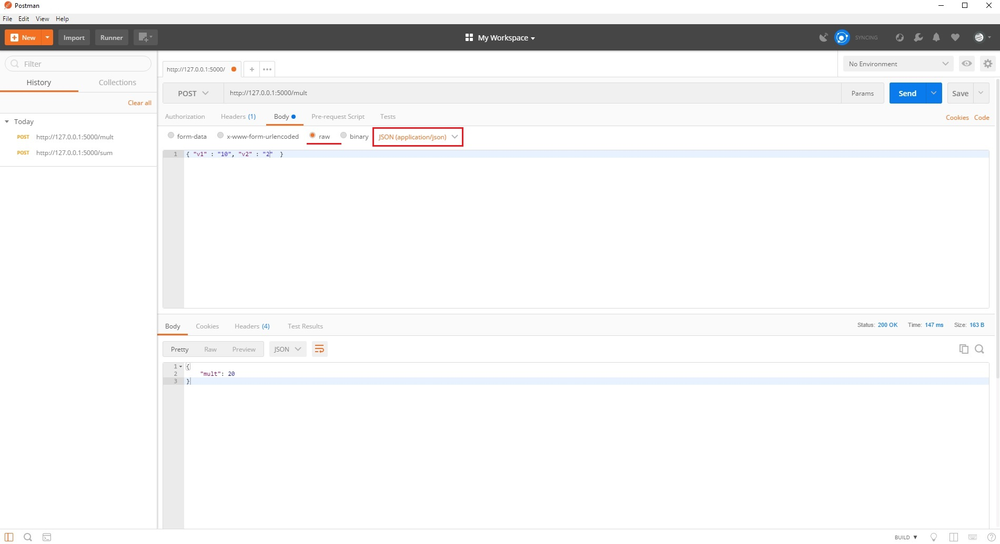
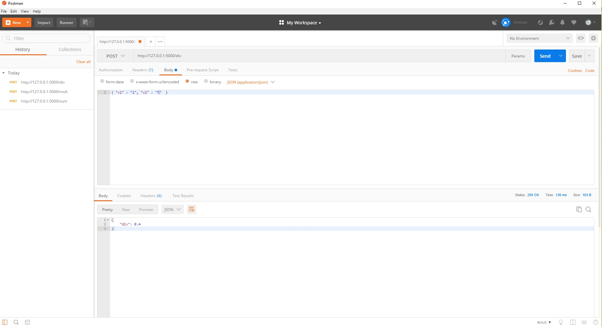
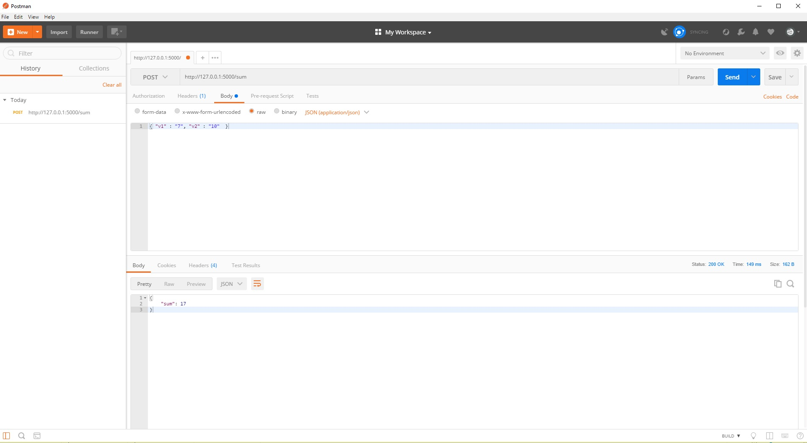
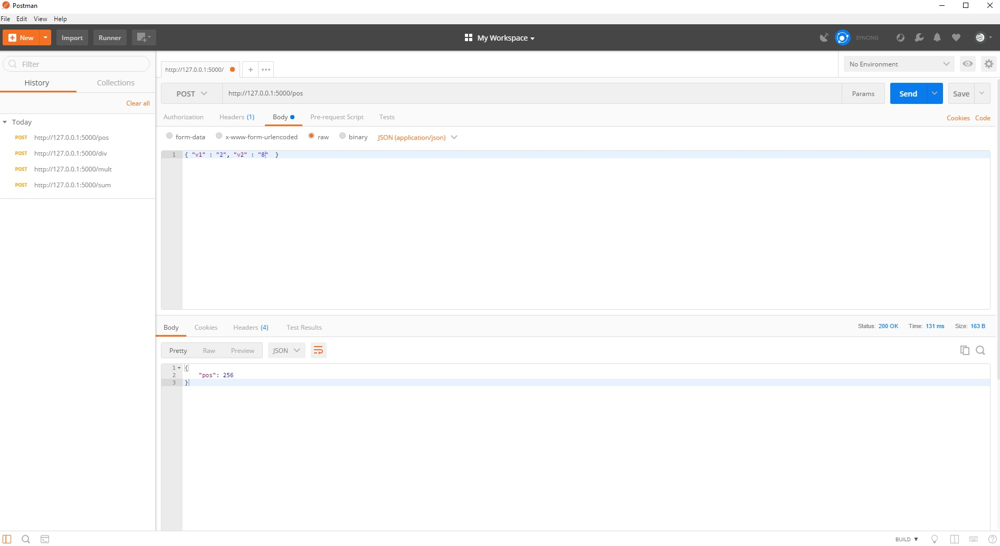
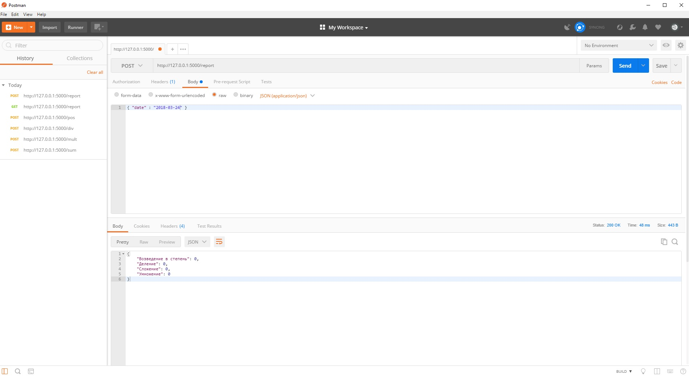

# Web API

## Задача

WEB API на основе фреймвёрка flask и sqlalchemy.
 
API имеет 5 функций:
- Умножение - метод POST, на вход подается 2 параметра, на выходе результат в формате JSON
- Деление - метод POST, на вход подается 2 параметра, на выходе результат(float) в формате JSON
- Сложение - метод POST, на вход подается 2 параметра, на выходе результат в формате JSON
- Возведение в степень - метод POST, на вход подается 2 параметра, на выходе результат в формате JSON
- Отчет о работе api за указанные сутки - метод GET, на вход подается 1 параметр (дата), на выходе результат суммарного вызова каждой математической функции в формате JSON вида:
    {'Сложение': 5, 'Умножение': 6, 'Деление':10, 'Возведение в степень':123}
 
На каждый вызов математических функций должна быть запись в таблице логов в БД.
Лог должен содержать следующую информацию (минимум):
- Дата
- IP-адрес клиента
- Входные параметры
- Результат работы функции

## Описание 

< loc_adr = 127.0.0.1:5000 по умолчанию.

WEB API имеет 5 функций:
- http://loc_adr/mult метод POST, умножение 2х чисел, результат в формате JSON
- http://loc_adr/div метод POST, деление 2х чисел, результат в формате JSON
- http://loc_adr/sum метод POST, сложение 2х чисел, результат в формате JSON
- http://loc_adr/pos метод POST, возведение в степень 2х чисел, результат в формате JSON
- http://loc_adr/report метод GET и POST, отчет работы за сутки

Можно посмотреть записи всех логов:
- http://loc_adr/logs метод GET


## Запуск

Для начала скопируйте все файлы в отдельный каталог. 
 < Пример C:\project\test_webapi\ 

Запуск можно осуществить 2 способами: 
- Через командную строку
- Собрать проект в PyCharm и скомпилировать с необходимыми библиотеками

Для начала в [database.py](https://github.com/rcv911/web-api-test/blob/master/database.py) нужно установить путь для БД.
По умолчанию путь прописан для Windows 
```python
	engine = create_engine('sqlite:///C:\\project\\test_webapi\\testDB.db', convert_unicode=True)
```

Запуск через командную строку:
- Указать путь, где находятся файлы 
- запустить Python интерпретатор
```
	path> python main.py
```

## Работа

Проверить работу можно с помощью [Postman](https://www.getpostman.com/)

- http://loc_adr/mult метод POST, умножение 2х чисел, результат в формате JSON
< На вход функции подается два параметра в формате JSON { "v1" : "<число1>", "v2" : "<число2>"}
< На выходе результат выполнения функции в формате JSON {"<ключ функции>" : <число1 * число2>} 


Аналогичным способом работают остальные математические функции:





- http://loc_adr/report метод GET и POST, отчет работы за сутки, на выходе результат суммарного вызова каждой математической функции в формате JSON вида
< На вход функции подается дата в формате JSON { "date" : "<год-месяц-день>"}
< На выходе результат выполнения функции в формате JSON {"Возведение в степень": <кол-во>, "Деление" : <кол-во>, "Сложение" : <кол-во>, "Умножение" : <кол-во>} 

Метод POST



Метод GET выдает на выходе результат суммарного вызова всех математических функций за всё время 


Пример показа записей всех логов за всё время:
- http://loc_adr/logs метод GET


## Библиотеки

- flask
- SQLAlchemy


